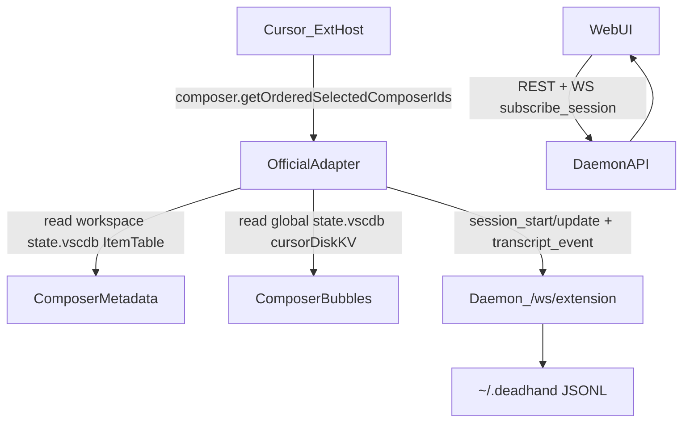

## Deadhand × Cursor Reverse Engineering Notes

This document captures what we've learned about **where Cursor stores composer/chat data** and **how the Deadhand extension reads and forwards it**.

The intent is to be a living reference as we continue debugging and reverse‑engineering. Storage formats may change with Cursor releases.

### Safety / scope

- **Transcripts can contain sensitive data**. We avoid copying actual conversation content into this doc.
- Observations here were gathered on **macOS** with Cursor, using SQLite inspection and extension runtime behavior.
- Where we say "observed", it means "confirmed with runtime evidence"; where we say "likely", it's an inference.

## Storage locations & schema

Cursor uses multiple SQLite "state" databases with a simple KV-table shape:

- **Workspace-scoped state DB**:
  - Path pattern (macOS): `~/Library/Application Support/Cursor/User/workspaceStorage/<workspaceId>/state.vscdb`
  - **Tables**:
    - `ItemTable (key TEXT UNIQUE ON CONFLICT REPLACE, value BLOB)`
    - `cursorDiskKV (key TEXT UNIQUE ON CONFLICT REPLACE, value BLOB)`

- **Global state DB**:
  - Path (macOS): `~/Library/Application Support/Cursor/User/globalStorage/state.vscdb`
  - **Tables**: same (`ItemTable`, `cursorDiskKV`)

### Key finding: metadata vs transcript split

- **Composer/session metadata** is primarily available via **workspace** `state.vscdb` → `ItemTable`.
- **Actual transcript bubbles (messages, tools, "Questions" UI)** are primarily stored in **global** `state.vscdb` → `cursorDiskKV`.

## What we read from the workspace DB

### `ItemTable` → `composer.composerData`

In the workspace DB, `ItemTable.key = 'composer.composerData'` contains a JSON blob with an `allComposers` array.

We parse this to build session metadata:

- `composerId` → our `sessionId`
- `name` → session title
- `unifiedMode` → `agent|chat|plan|debug|background`
- `lastUpdatedAt`, `createdAt`
- `contextUsagePercent`, `totalLinesAdded`, `totalLinesRemoved`, `filesChangedCount`
- `subtitle`, etc.

This is implemented in:
- `packages/extension/src/storage-reader.ts` (`getAllComposers()`, `parseComposerValue()`)
- `packages/extension/src/adapters/official.ts` (`buildEnrichedSession()`)

## What we read from the global DB (the transcript source)

### `cursorDiskKV` → `composerData:<composerId>`

In the global DB, `cursorDiskKV.key = 'composerData:<composerId>'` contains a JSON object representing the composer's state.

Important fields we rely on:

- `fullConversationHeadersOnly: Array<{ bubbleId: string; type: number }>`
  - `type` is observed as:
    - `1` → user bubble
    - `2` → assistant bubble
- `modelConfig.modelName` (e.g. `gpt-5.2`)
- `modelConfig.maxMode` (boolean): whether "max mode" is enabled for this session
- `unifiedMode` (string): the session mode (`agent`, `chat`, `plan`, `debug`, `background`)
- `text` / `richText` (string): current input box draft content (not yet submitted)

### `cursorDiskKV` → `bubbleId:<composerId>:<bubbleId>`

Each header's `bubbleId` points to an individual bubble record stored under:

- `cursorDiskKV.key = 'bubbleId:<composerId>:<bubbleId>'`

Observed bubble fields of interest:

- **Content**
  - `text` (string): primary visible text shown in Cursor.
  - `richText` (string): sometimes present as an alternative representation.
  - Some bubbles have `text = ""` but still contain structured data (tools, thinking, etc.).

- **Model**
  - `modelInfo.modelName` (string): observed to contain the model label (e.g. `gpt-5.2`).
  - `modelInfo.model` may exist but is not consistently populated.

- **Timestamps / IDs**
  - `createdAt` (ISO string)
  - `bubbleId` (UUID)

- **Tool bubbles**
  - `toolFormerData` object indicates a tool invocation recorded as a bubble.
  - Example: `toolFormerData.name = 'ask_question'`
  - `toolFormerData.rawArgs` is a JSON string (not an object) containing tool arguments.

#### "Questions" UI (Cursor) = `ask_question` tool bubble

Cursor's "Questions" UI (the multiple choice prompts in the composer) is stored as:

- Bubble contains: `toolFormerData.name = 'ask_question'`
- Tool args are in: `toolFormerData.rawArgs` (stringified JSON)

Observed schema:

- `rawArgs.title: string`
- `rawArgs.questions: Array<{ id: string; prompt: string; options: Array<{ id: string; label: string }> }>`

## How the Deadhand extension reads and forwards data

### High-level flow



### Adapter selection

The extension chooses a data source adapter in `packages/extension/src/cursor-adapter.ts`:

- **Official adapter** (`packages/extension/src/adapters/official.ts`) is preferred.
  - Polls `composer.getOrderedSelectedComposerIds` every 2s.
  - Reads rich metadata + transcript data from SQLite.
- Logs adapter is a fallback (disabled by default, can be enabled via `deadhand.enableLogsAdapter`).

### Transcript extraction strategy

`CursorComposerStorageReader.getConversationTranscript(composerId)`:

1. **Legacy / workspace attempts**:
   - Looks for various `ItemTable` keys (historical guesses like `composer.conversation.<id>`).
   - Tries pattern matching on `ItemTable` where key/value contains the composerId.
2. **Global cursorDiskKV fallback (current working path)**:
   - Loads `composerData:<composerId>` from **global** `cursorDiskKV`.
   - Walks `fullConversationHeadersOnly` and reads each `bubbleId:<composerId>:<bubbleId>`.
   - Extracts:
     - `text`/`richText` → message content
     - `createdAt` → timestamp
     - `modelInfo.modelName` (or `modelInfo.model`) → model label
     - `toolFormerData` → tool call (e.g., `ask_question`)

This fallback is implemented in:
- `packages/extension/src/storage-reader.ts` → `loadTranscriptFromGlobalCursorDiskKV()`

### `ItemTable` → `applicationUser` (enabled models)

The global DB also stores Cursor's reactive UI state under:

- `ItemTable.key = 'src.vs.platform.reactivestorage.browser.reactiveStorageServiceImpl.persistentStorage.applicationUser'`

This JSON blob contains user preferences and available models:

- `availableDefaultModels2: Array<ModelConfig>` — list of models configured in Cursor

Each `ModelConfig` object includes:

| Field | Type | Description |
|-------|------|-------------|
| `name` | string | Internal model ID (e.g., `gpt-5.2`, `claude-3.5-sonnet`) |
| `clientDisplayName` | string | UI display label |
| `serverModelName` | string | Server-side identifier |
| `defaultOn` | boolean | Whether this model is enabled by the user |
| `supportsMaxMode` | boolean | Whether model supports "max" reasoning mode |
| `supportsThinking` | boolean | Whether model supports thinking/chain-of-thought |

We filter to `defaultOn === true` to get the user's enabled models.

This is implemented in:
- `packages/extension/src/storage-reader.ts` → `getApplicationUserState()`, `getEnabledModels()`

### Deduplication

When the extension emits transcript events:

- Each message/tool bubble has a **stable ID** (`bubbleId` UUID).
- We use that as `sourceId` so the daemon can safely dedupe on resync/reconnect.

### Session model name

Composer model name isn't reliably available from workspace `composer.composerData`, so we also read:

- `global cursorDiskKV composerData:<composerId>.modelConfig.modelName`

and send `session_update { model }` best-effort.

This is implemented in:
- `packages/extension/src/storage-reader.ts` → `getComposerModelName()`
- `packages/extension/src/adapters/official.ts` (calls `getComposerModelName()` and `client.updateSession({ model })`)

## How the daemon and web UI consume it

### Daemon ingest and persistence

- Extension connects to daemon websocket: `/ws/extension`
- Daemon persists:
  - Sessions: `~/.deadhand/sessions.jsonl`
  - Transcript events: `~/.deadhand/transcripts/<sessionId>.jsonl`

Relevant daemon code:
- `packages/daemon/src/websocket.ts` (handles extension messages)
- `packages/daemon/src/registry.ts` (in-memory state, dedupe, retention)
- `packages/daemon/src/persistence.ts` (JSONL append + reload)

### Web UI rendering

The web UI:

- Subscribes over WS (`subscribe_session`) for live events
- Fetches history over REST (`GET /api/v1/sessions/:id`)
- Renders messages + tool events in the "Soviet terminal" style.

Relevant web files:
- `packages/web/src/components/Dashboard.tsx`
- `packages/web/src/components/TranscriptView.tsx`

## Write path: submitting a message

This section documents what we've learned about **sending user messages** to a Cursor composer session programmatically.

### Discovery summary

Cursor exposes many internal commands via VS Code's command API. We discovered these by:

1. Extracting command IDs from Cursor's bundled workbench JS (`/Applications/Cursor.app/Contents/Resources/app/out/vs/workbench/workbench.desktop.main.js`)
2. Running Deadhand's debug commands (`deadhand.debug.listComposerCommands`, `deadhand.debug.probeAllCursorAPIs`)

### Relevant commands discovered

**Submit/send commands:**
- `composer.submit` — main submit command (requires text to already be in the input)
- `composer.startComposerPrompt` — may start a new composer with a prompt (parameter: prompt string)
- `composer.sendToAgent` — possibly sends current composer state to agent mode
- `workbench.action.chat.submit` — VS Code workbench chat submit
- `composer.triggerCreateWorktreeButton` — **submits the current composer input** (used after `createNew`)

**Create/navigation commands:**
- `composer.createNew` — **create a new composer** with optional `partialState` (see below)
- `composer.openComposer` — open/focus a specific composer by ID (parameter: `composerId`)
- `composer.focusComposer` — focus the current composer
- `workbench.action.chat.focusInput` — focus the chat input field
- `composer.getOrderedSelectedComposerIds` — returns array of active composer IDs (used for detection)

**Mode commands:**
- `composerMode.agent`, `composerMode.chat`, `composerMode.plan`, `composerMode.debug`, etc.

### What works and what doesn't

**Working approaches:**

1. **`composer.startComposerPrompt`**: Can be called with a message string. This appears to populate the composer input with the provided text and may start a new conversation. However, it doesn't reliably target a specific `composerId`.

2. **`composer.openComposer` + focus**: Can open a specific composer by ID, but there's no direct command to inject text into the input field and submit it.

**Not working (yet):**

- There's no discovered command that accepts `(composerId, messageText)` and directly submits a message to a specific session.
- The internal composer input is managed by a webview/custom editor, not accessible via standard VS Code text document APIs.

### Deadhand implementation

The send message functionality is implemented in:
- `packages/extension/src/debug.ts`:
  - Debug commands for testing:
    - `deadhand.debug.sendMessageToComposer` — tries multiple strategies
    - `deadhand.debug.execCommand` — generic command executor for exploration

- `packages/daemon/src/websocket.ts` — handles `send_message` from web UI, forwards to extension
- `packages/daemon/src/types.ts` — message types for send_message request/result
- `packages/extension/src/daemon-client.ts` — handles incoming `send_message_request` from daemon
- `packages/extension/src/extension.ts` — wires up the message sending handler

### Reproducing the discovery

1. Open Cursor with the Deadhand extension installed
2. Enable debug mode: `"deadhand.debugMode": true`
3. Run `Deadhand Debug: List Composer Commands` from command palette
4. Run `Deadhand Debug: Execute Arbitrary Command` to test individual commands

### Future improvements

- Monitor for new Cursor commands that might accept message text directly
- Explore Cursor's extension host process for additional IPC mechanisms
- Consider writing a companion extension that registers as an MCP server to receive prompts

## Write path: creating a new chat

This section documents how we **create new chat sessions** remotely with a specified mode and model.

### Discovery: `composer.createNew`

The `composer.createNew` command accepts an options object with a `partialState` field that can pre-populate the new composer:

```typescript
await vscode.commands.executeCommand('composer.createNew', {
  openInNewTab: true,
  partialState: {
    unifiedMode: 'agent',        // 'agent' | 'chat' | 'plan' | 'debug' | 'background'
    text: 'Your prompt here',    // Pre-fill input text
    richText: 'Your prompt here', // Alternative text representation
    modelConfig: {
      modelName: 'gpt-5.2',      // Model to use
      maxMode: false             // Whether to use max mode
    }
  }
});
```

### Detecting the new composerId

After calling `createNew`, the new composer becomes selected. We detect its ID by:

1. **Before**: Call `composer.getOrderedSelectedComposerIds` to get current IDs
2. **Create**: Call `composer.createNew` with desired state
3. **After**: Call `composer.getOrderedSelectedComposerIds` again
4. **Diff**: The new ID is the one not in the "before" list

### Submitting the prompt

Creating a composer with `text` populated doesn't automatically submit it. To submit:

1. Optionally call `composer.openComposer(composerId, { focusMainInputBox: true })` to ensure focus
2. Call `composer.triggerCreateWorktreeButton` to submit the input

### Verification

After submission, we poll the transcript to verify the message was delivered:

1. Read transcript from `cursorDiskKV bubbleId:<composerId>:*`
2. Hash the expected message content
3. Check if a user bubble with matching content hash appears
4. Timeout after ~8 seconds if not found

### Implementation

The create chat flow is implemented in:
- `packages/extension/src/extension.ts` → `onCreateChatRequest` handler
- `packages/daemon/src/websocket.ts` → handles `create_chat` from web UI
- `packages/web/src/components/SessionList.tsx` → UI for creating new chats

## Open questions / next reverse-engineering targets

- **Thinking blocks**: some bubbles include `thinking.signature` JSON containing `encrypted_content` + `summary`. Decryption and schema are unknown.
- **Tool results**: not all tools store output uniformly; some data appears in large nested arrays (`toolResults`, `diffHistories`, `codeBlocks`, etc.).
- **Non-active / archived sessions**: confirm how Cursor persists old conversations and whether `fullConversationHeadersOnly` is always sufficient.
- **Cross-platform**: validate Windows/Linux paths and any schema differences.
- **Direct message injection**: find a cleaner way to submit messages to a specific composerId.
